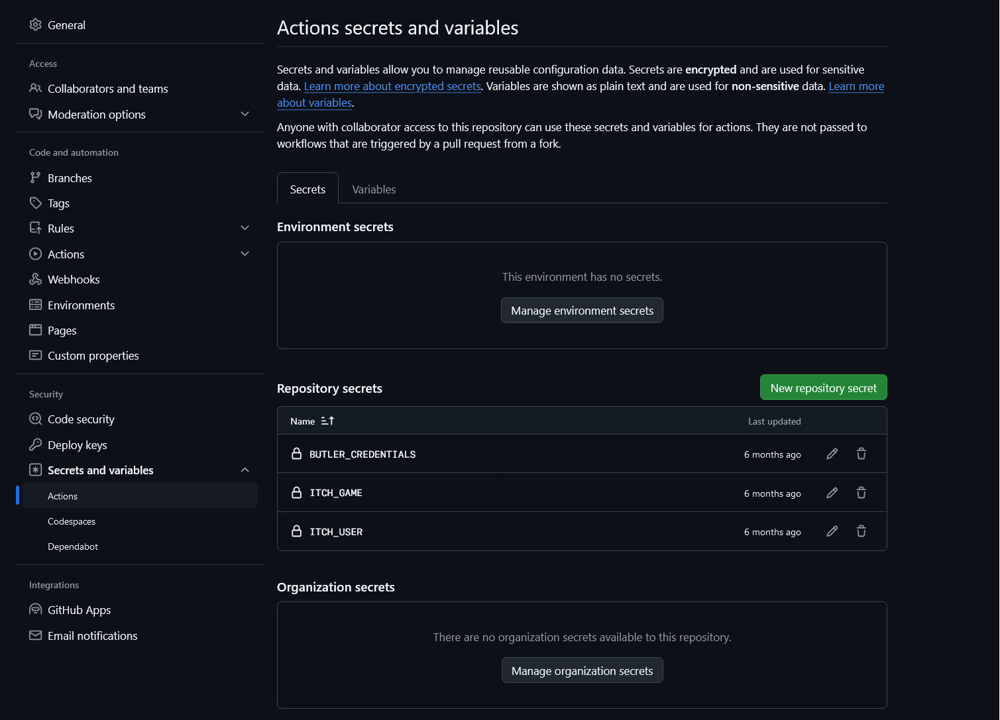
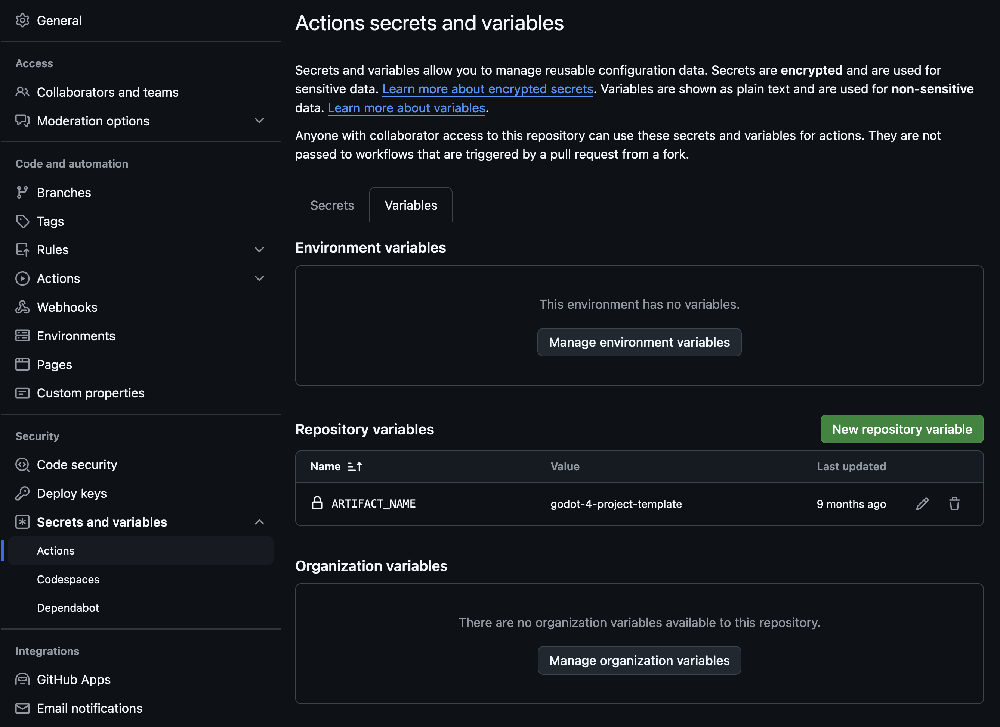
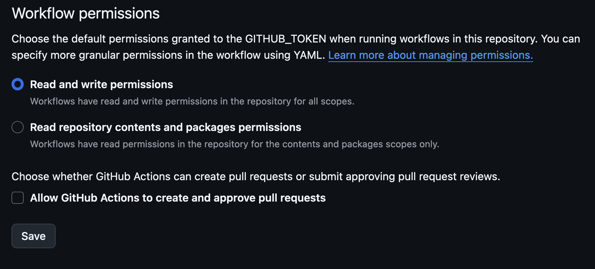
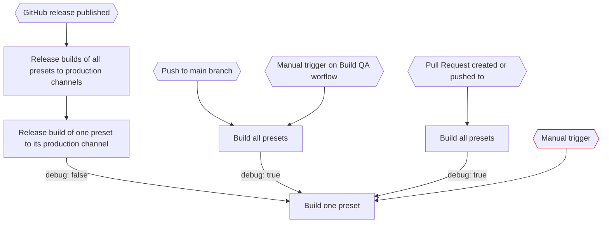

# Godot 4 Project Template

[](https://github.com/shapeshiftingrabbits/godot-4-project-template/actions/workflows/build_qa.yml)

[](https://github.com/shapeshiftingrabbits/godot-4-project-template/actions/workflows/release_production.yml)

## GitHub Action Workflows

This template is for Godot version: 4.3

### How to setup

When using this template, you need to set the variables and secrets used by GitHub Actions.

- Secrets used by the [Github Action that pushes builds to itch.io](https://github.com/marketplace/actions/butler-push)
  - Do a global search for the string `secrets.` on the project to find the variables that need to be set.
  - Go to the settings of your repository and add them as shown in the screenshot below.
    

- The `vars.ARTIFACT_NAME` repository variable, which will prefix the name of the artifact files
  - Go to the settings of your repository and add them as shown in the screenshot below.
    

- Give workflows write permissions, so they can create it tags shown in the screenshot below.
  

### How to update Godot version

When using a different version of Godot, you need to:

- Update the Godot version of the project itself, by opening this repository with Godot. Godot should do the update when prompted.
- In [build_single_preset.yml](./.github/workflows/build_single_preset.yml)
  - Update the `GODOT_VERSION` environment variable with the Godot version you use. E.g.

    ```yaml
    env:
      GODOT_VERSION: 4.3
    ```

  - Update the docker image, the latest supported version should be used in the project's [template action](https://github.com/abarichello/godot-ci/blob/master/.github/workflows/godot-ci.yml). E.g.

    ```yaml
    container:
      image: barichello/godot-ci:4.3
    ```

  - Check if other github actions need updating. Do a global search on the project on the term `uses:` and check if new versions are available.

### How it works

- Create `debug` artefacts (builds) for the 4 platforms: web, windows, linux and mac.
  - Push changes to main, create a pull request or do a manual trigger on `build_all_presets.yml`.
- Publish `release` artefacts on itch.io
  - Create a Github release.

**TODO**

- Create an artefact for 1 platform
  - Do a manual trigger on build_single_preset

#### Diagram



### Intentions and processes

- We want to be able to test builds before merging code changes to `main`
  - We generate downloadable artifacts when creating a PR
  - We generate further artifacts for further changes in the PR
- We want to be able to test builds after merging code changes to `main`
  - We this ability call this 'QA'
  - We generate downloadable artifacts after merging to `main`, with debug mode on
  - We tag commits to `main` with the 'QA' build job number, so we are able to reference a commit back to a specific 'QA' build job and its specific artifacts
- We want to be able to release the game from specific commits on `main` we are happy with
  1. We manually publish a GitHub release with a new version number
     - This version number will be publicly visible
     - The version number progression does not necessarily follow semantic versioning
  1. We generate artifacts, with debug mode off
  1. We upload the artifacts to Itch.io
  1. We tag the commit used to create the release with the 'Release' build job number, so we are able to reference a commit back to a specific 'Release' build job and its specific artifacts

TODO:
- Fix yaml syntax highlighting
- Add instructions for vars.ARTIFACT_NAME
- Update title of sections
