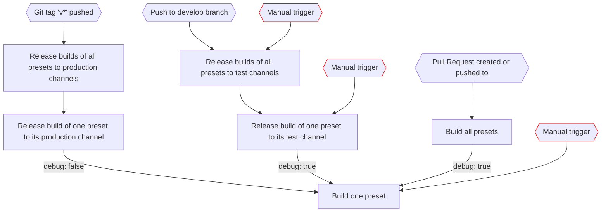

# Godot Project Template

## GitHub Action Workflows

### Intentions

- Be able to test builds before merging code changes to `main`
  - Create artifacts for each platform when creating a PR
  - Create further artifacts for further pushes to the PR
- Be able to test builds after merging code changes to `main`
  - Create artifacts after merging to `main`
  - Tag merge commits with build job number to be able to track job that holds artifacts
- Be able to release game from commits on `main` we are happy with
  1. Tag commit with public version number (manual)
  2. Create artifacts for each platform (with debug mode off)
  3. Upload artifacts to Itch.io
  4. Tag merge commits with build job number to be able to track job that generated and uploaded artifact

### Diagram

