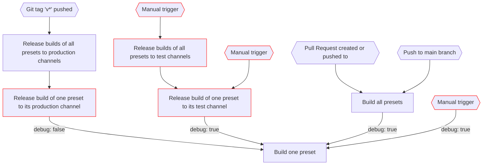

## GitHub Action Workflows

```mermaid
flowchart TB
    classDef todo stroke:#f00
    classDef in_progress stroke:#770

    tag_push{{"Git tag 'v*' pushed"}}
    release_production_all["Release builds of all presets to production channels"]
    release_production_one["Release build of one preset to its production channel"]:::todo

    release_test_all_manual_trigger{{"Manual trigger"}}:::todo
    release_test_all["Release builds of all presets to test channels"]:::todo

    release_test_one_manual_trigger{{"Manual trigger"}}:::todo
    release_test_one["Release build of one preset to its test channel"]:::todo

    pull_request_trigger{{"Pull Request created or pushed to"}}
    main_branch_trigger{{"Push to main branch"}}
    build_all["Build all presets"]

    build_manual_trigger{{"Manual trigger"}}:::todo
    build_one["Build one preset"]

    release_production_all --> release_production_one -- debug: false --> build_one
    release_test_all --> release_test_one -- debug: true --> build_one

    tag_push --> release_production_all
    release_test_all_manual_trigger --> release_test_all
    release_test_one_manual_trigger --> release_test_one
    pull_request_trigger --> build_all
    main_branch_trigger --> build_all
    build_all -- debug: true --> build_one
    build_manual_trigger -- debug: true --> build_one
```
